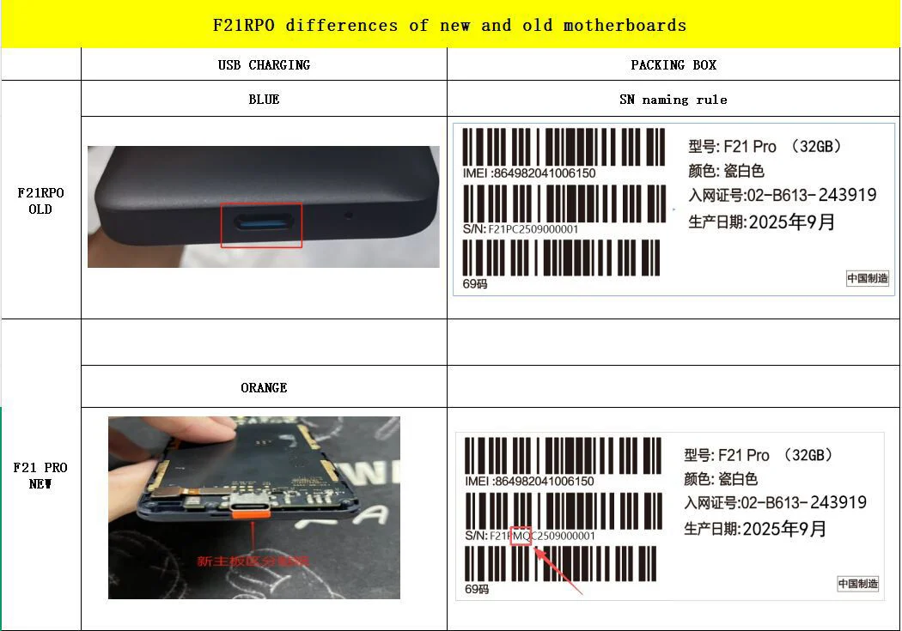

# # ROM and Guide For Xiaomi Qin F21 Pro            with MT8766B CPU

**<u> Eeep Eeep The Labubu's Xiaomi Qin F21 Pro MT8766B Guide
</u>**                       .jpg )

This is a (very long and technical) guide for everyone who has received the new v2/v3 Qin F21 Pro.

Please **<u>DO NOT</u>** follow any other Qin F21 Pro guides as they are meant for the MT6761 variant.

Because newer builds of the F21 Pro have this newer processor,they can be damaged or bricked by following these instructions.

Due to the difference in chipset, this phone DOES NOT WORK with Bjorn Kerler's brilliant but inaccessible MTKClient and potentially with Mediatek's SP Flash utility

If it is connected to these, it will produce DAA_SIG_VERIFY_ERROR and STATUS_BROM_CMD_SEND_DA_FAIL in SP Flash because Xiaomi has enabled DAA security protection on these devices. 

These phones will also not enter traditional recovery modes using key combinations like the original F21. If you have any of these indicators, you probably have an F21 Pro V2:

        

Internal back of phone with A666-MB-V0.2      Red paper charging cable insert, serial number

**Let's screw over all the Aliexpress sellers that charge extra for "USA phones"! we can still flash these phones, root them and enable USA bands!**

<u>If you wish to flash your phone to USA bands for compatibility with ATT,Verizon and T-Mobile, please refer to Eeep Eeep's USA Bands Tutorial.</u>

In order to do this, we will need to flash over fastboot. This can be more complicated and unforgiving for non-technical people, so please follow this guide with the assistance of a friendly Labubu to help :)

<b>
Necessary software:
</b>

- ADB and Fastboot installed (sudo apt install android-tools-adb android-tools-fastboot, or platform-tools on Windows)

- lpmake and img2simg (see Appendix)

- Preferably Linux but Windows can work using Command Prompt

- Fastboot Autobooter (if bricked/bootlooped)

- fss-hacks DumberOS custom image files (mostly from Releases):
  -super_new.img (Rebuilt super containing DumberOS)
  -boot_a.bin (Stock TWRP-less boot image)
  -boot_a_twrp.bin (TWRP, for backup access)
  -super.bin/my_super.bin (Stock super - you create this yourself!)

- 4/64 Xiaomi Qin F21 Pro (not 3/32, sorry!)

Notes on these images:
boot_a_twrp.bin is a Russian-language TWRP build. Change it under Settings → the globe icon after first boot.
super_new.img contains DumberOS 20260803-gapps30 plus the stock vendor_a and product_a from firmware version 1.1.1. If your stock firmware version differs, build your own — see the Long Path.
None of these files contain IMEI, MAC addresses, or RF calibration. Boot, system, vendor and product partitions hold no per-device identifiers.

nvram, nvdata, nvcfg and md1img_a hold your IMEI and RF calibration. They are not included here and must never be shared or cross-flashed. Doing so clones another handset’s identity onto yours and destroys your own — on MT8766 there is no SN Write Tool to undo it. 

**READ THIS FIRST, IRREVERSIBLE CHANGES!:**

Unlocking the bootloader erases all user data. Back up photos, contacts, messages and app data first.
Record your IMEI from Settings → About phone, and from the box or under the battery. Photograph it.
On MT8766 there is no BROM recovery path. SP Flash Tool and SN Write Tool cannot help you if something goes wrong. The partition backups taken in Step 4 are your only rollback — treat them accordingly.


<b>Step 1 — Unlock the bootloader</b>

Skip if already unlocked. 

Enable Developer options (tap Build number 7×), then OEM unlocking and USB debugging. 
`adb devices`

`adb reboot bootloader`

`fastboot devices
fastboot flashing unlock`

``Confirm on the phone. This wipes the device. Boot back into Android and re-enable USB debugging. 

****

**Step 2 — Check compatibility**

Before anything destructive, confirm your device matches what super_new.img expects. You need root or TWRP to read this — if you have
neither yet, do Step 3 first and come back. 
`adb shell lpdump`

Compare against: 
`super block device size 4294967296
vendor_a 633,056 sectors (324,124,672 bytes)
product_a 437,976 sectors (224,243,712 bytes)
header flags virtual_ab_device`

If the super size or the vendor/product sizes differ, stop and use the Long Path at the end — your firmware version isn’t the one this image
was built from, and flashing it would pair DumberOS with a mismatched vendor. 


**Step 3 — Install TWRP 
**** You need block-level access to back up super. TWRP is the simplest route. 
Already rooted with Magisk? Skip this step entirely and run the Step 4 commands with `su -c `instead. That leaves boot_a untouched. 
`adb reboot bootloader
fastboot devices
fastboot flash boot_a boot_a_twrp.bin
fastboot reboot`

boot_a is a physical partition, so ordinary bootloader fastboot writes it — no mtkclient required. 
The phone boots into TWRP (in Russian). Confirm adb sees it: 
`adb devices `# expect: <serial> recovery

The F21 Pro has no separate recovery partition — it is recovery-as-boot, so boot_a holds the ramdisk. TWRP has now replaced it, and the phone
will boot nothing else until Step 6 restores boot_a.bin. 

**Step 4 - Backup**

****Do not skip this. Use cat, never dd — dd writes its summary to stdout and corrupts the output by ~91 bytes. On Windows use cmd.exe, not PowerShell, which mangles binary redirects. 
`adb exec-out "cat /dev/block/by-name/super" > my_super.bin
adb exec-out "cat /dev/block/by-name/vbmeta_a" > my_vbmeta_a.bin
adb exec-out "cat /dev/block/by-name/md1img_a" > my_md1img_a.bin
adb exec-out "cat /dev/block/by-name/nvram" > my_nvram.bin
adb exec-out "cat /dev/block/by-name/nvdata" > my_nvdata.bin`

`adb exec-out "cat /dev/block/by-name/nvcfg" > my_nvcfg.bin`

Verify super byte-for-byte: 
`ls -l my_super.bin # expect 4294967296
md5sum my_super.bin
adb shell md5sum /dev/block/by-name/super`

``Do not continue until those hashes match. 

Copy the whole set to separate media. 
<u>The last three files hold your IMEI and RF calibration. They are unique to your handset and no tool can regenerate them. </u>




**Step 5 — Flash **
`adb reboot bootloader
fastboot devices
fastboot flash super super_new.img
fastboot --disable-verity --disable-verification flash vbmeta_a my_vbmeta_a.bin`

Flash the sparse super_new.img as-is — do not convert it. Takes several minutes; do not interrupt. 
Use your own my_vbmeta_a.bin here. The disable flags are rewritten in transit, so no separate “empty vbmeta” file is needed. GSIs are signed with their own keys and will not pass stock verification without this. 

<b>Step 6 — Restore the stock boot image</b>
This removes TWRP. It is required — DumberOS is a GSI and cannot boot on a TWRP ramdisk. 
`fastboot flash boot_a boot_a.bin
fastboot getvar current-slot # expect: a
fastboot reboot`

Keep boot_a_twrp.bin — reflashing it is how you get recovery back later. 

**
Step 7 — First boot **
Expect an Orange State warning; press power to continue. I did not get one but you may. 
First boot takes 5–10 minutes. A blank or static screen at minute four is normal. Do not interrupt or unplug. 
If the phone lands in fastbootd (coloured text) or a “No command” screen instead of booting, a stale boot-control flag is sending it to recovery: 
`fastboot reboot bootloader`
`fastboot erase para `# 'para' is MTK's misc partition
`fastboot reboot`

Leave boot_para alone — despite the name, it is a different partition. 

Wi-Fi may not scan on the first boot. Reboot once more before troubleshooting
Once up, check Settings → About phone: your IMEI should be present and match what you recorded. 

 Rollback 
All of these run from bootloader fastboot, reachable whatever state the system is in:
Problem Fix
Won’t boot / want stock back?
`fastboot flash super my_super.bin
`Need recovery access?
`fastboot flash boot_a boot_a_twrp.bin `(Boots to TWRP only)
dm-verity corruption message? 
Repeat the vbmeta command in Step 5
Stuck in recovery / fastbootd?
`fastboot erase para `

**Building your own super_new.img **
Only needed if your lpdump in Step 2 didn’t match or you want to flash a newer more updated DumberOS build. 
Do this from TWRP after Step 4. Extract the partitions you’re keeping: 
`adb exec-out "cat /dev/block/mapper/vendor_a" > vendor_a.img
adb exec-out "cat /dev/block/mapper/product_a" > product_a.img`

Sizes must match your lpdump extents exactly. No lpunpack needed — logical partitions are already exposed as block devices. 
Get lpmake (it is a host tool, unrelated to TWRP’s on-device lptools, and ships in no Ubuntu repo): 
`git clone https://github.com/Rprop/aosp15_partition_tools.git
cd aosp15_partition_tools/linux_glibc_x86_64 && chmod +x *`

Its simg2img is dynamically linked and may fail with a libc++.so error — use the android-sdk-libsparse-utils package version instead. 
`lpmake rejects raw ext4 input on some builds, so convert first: 
sudo apt install android-sdk-libsparse-utils
img2simg dumber_os-XXXXXXXX-gapps30-signed.img system_a.simg
img2simg vendor_a.img vendor_a.simg
img2simg product_a.img product_a.simg`

Build, substituting your own numbers from lpdump: 
`lpmake \
--metadata-size 65536 \
--metadata-slots 3 \
--super-name super \
--device super:4294967296 \
--group main_a:3221225472 \
--group main_b:1048576000 \
--partition system_a:readonly:2311557120:main_a \
--image system_a=system_a.simg \
--partition vendor_a:readonly:324124672:main_a \
--image vendor_a=vendor_a.simg \
--partition product_a:readonly:224243712:main_a \
--image product_a=product_a.simg \
--partition system_b:readonly:0:main_b \
--partition vendor_b:readonly:0:main_b \
--partition product_b:readonly:0:main_b \
--virtual-ab \
--sparse \
--output super_new.img`

Rules: 


--metadata-slots must be set explicitly; lpmake will not default it
--partition sizes must match their image files exactly
main_a must exceed the sum of its partitions, with headroom
Drop --virtual-ab if your header flags didn’t include it 
Verify before flashing: 
`simg2img super_new.img super_raw.img
lpdump super_raw.img`

Confirm main_a shows the new larger cap and system_a matches your ROM image byte count. Then return to Step 5. 

**
Known issues:
** With system at ~2.2 GB in a 4 GiB super there is no room for virtual A/B snapshots, so in-place OTA updates will not work. Update by rebuilding the images as shown and reflashing super.

</html>
